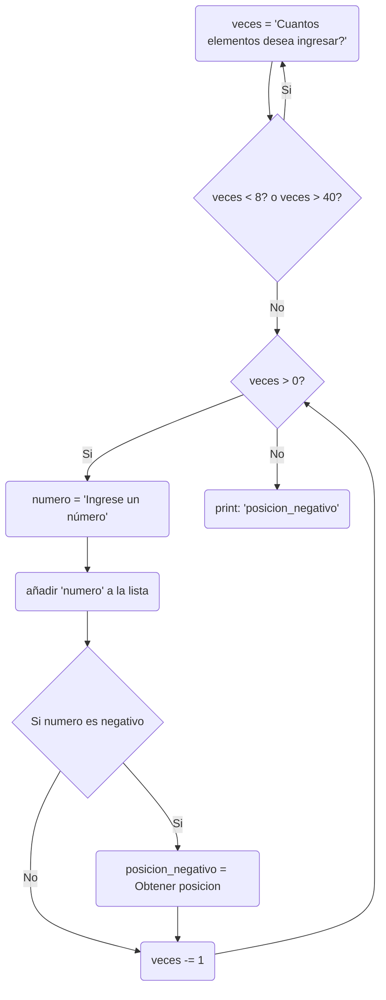

### 2) Dibujar un diagrama de flujo de datos que permita cargar y determinar e imprimir la posición del
último elemento negativo dentro de un vector X con datos numéricos enteros ingresados por el
usuario, con entre 8 y 40 elementos.
#Diagrama:

#Grafo, Caminos, Cálculos:
```mermaid
flowchart TD
	1((1)) --> |i| 2((2))
    2 --> |ii| 1
    2 --> |iii| 3((3))
    3 --> |iv| 4((4))
    4 --> |v|5((5))
    5 --> |vi|6((6))
    6 --> |vii| 7((7))
    6 --> |viii| 8
    7 --> |ix|8((8))
    8 --> |x|3
    3 --> |xi|9((9))
Nodos=9\nAristas=11\nNodos_Predicados=3\nRegiones=4
CALCULOS_CICLOMÁTICOS:\nAristas-Nodos+2=4\nNodos_Predicados+1=4\nRegiones=4
Caminos_Posibles:\n1,2,3,4,5,6,8,3,9\n1,2,3,4,5,6,7,8,3,9\n1,2,3,4,5,6,8,3,4,5,6,7,8,3,9\n1,2

style 2 fill:#03FAAF,color:#000000
style 3 fill:#03FAAF,color:#000000
style 6 fill:#03FAAF,color:#000000
style 9 fill:#FF0000,color:#000000
```

