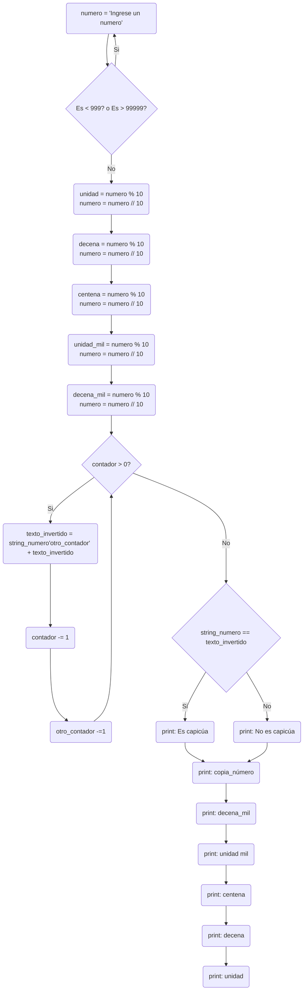

### 4) Escriba un diagrama de flujo que permita ingresar un número entero positivo entre 999 y 99999,
que imprima el número ingresado, que lo descomponga en unidad, decena, centena, unidad de
mil, decena de mil (según el tamaño del número), y que determine e imprima un mensaje
avisando si el número ingresado es capicúa o no.
Por ejemplo, si el número ingresado fuera 564, tendríamos Unidad=4, Decena=6 y Centena=5, y
habrá que imprimir “564 no es capicúa”, en cambio si el número ingresado fuera 565, habría que
imprimir “565 es capicúa”.

# Diagrama:


# Grafos, caminos y cálculos:
```mermaid
flowchart TD
    1((1)) -->|i| 2((2))
    2 --> |ii| 1
    2 --> |iii| 3((3))
    3 --> |iv|4((4))
    4 --> |v|5((5))
    5 --> |vi|6((6))
    6 --> |vii|7((7))
    7 --> |viii|8((8))
    8 --> |ix|9((9))
    9 --> |x|10((10)) --> |xi|11((11))
    11 --> |xii|8
    8 ---> |xiii| 12((12))
    12 --> |xiv|13((13))
    12 --> |xv|14((14))
    13 --> |xvi|15((15))
    14 --> |xvii|15
    15 --> |xviii|16((16))
    16 --> |xix|17((17))
    17 --> |xx|18((18))
    18 --> |xxi|19((19))
    19 --> |xxii|20((20))
    style 2 fill:#03FAAF,color:#000000
    style 8 fill:#03FAAF,color:#000000
    style 12 fill:#03FAAF,color:#000000
    style 20 fill:#FF0000,color:#000000
    Nodos=20\nNodos_predicados=3\nAristas=22\nRegiones=4
    CALCULOS_CICLOMÁTICOS:\nAristas-Nodos+2=4\nNodos_predicados+1=4\nRegiones=4
    CAMINOS_POSIBLES:\n1,2,3,4,5,6,7,8,9,10,11,8,12,13,15,16,17,18,19,20\n1,2,3,4,5,6,7,8,9,10,11,12,14,15,16,17,18,19,20\n1,2,3,4,5,6,7,8,9,10,11,8\n1,2
```
